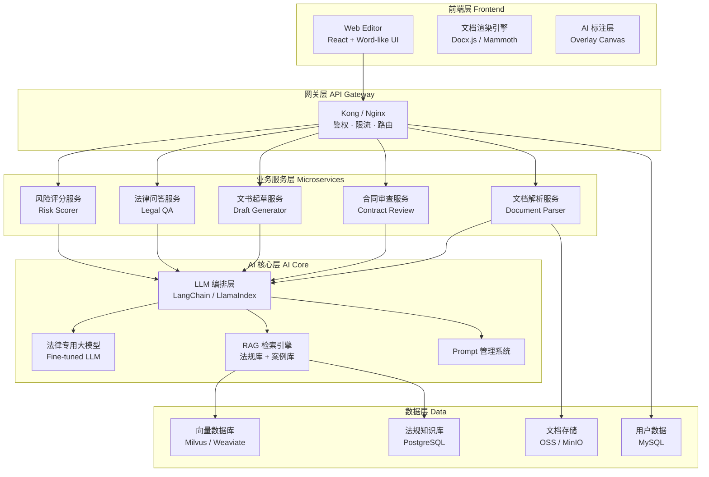
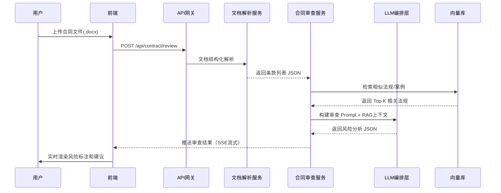
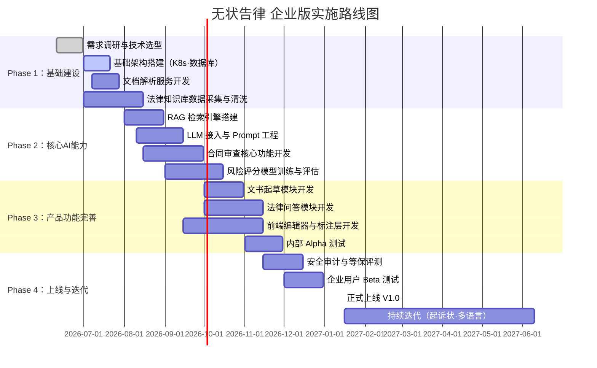

# 无状告律 · AI 法律助手平台 — 功能分析与企业技术规划

---

## 一、产品功能分析

### 1.1 产品概述

**无状告律**是一款面向企业法务、律师事务所及个人用户的 **AI 法律文书智能处理平台**。核心价值在于将大语言模型与法律专业知识深度融合，实现合同全生命周期管理、法律文书智能起草与风险实时预警。

---

### 1.2 核心功能模块（基于界面截图）

| 模块 | 功能描述 | 当前状态（截图可见） |
|------|----------|------------|
| 📋 **合同审查** | 上传合同文件，AI 逐条解析条款合规性、识别风险点、给出修改建议 | ✅ 已实现（右侧审查面板） |
| 📝 **文件起草** | 基于模板和用户输入，自动生成标准法律文书 | ✅ 已实现（顶部菜单） |
| ⚖️ **法律问答** | 自然语言提问，获取法律条文解读和实务建议 | ✅ 已实现（顶部菜单） |
| 📄 **起诉状** | 辅助生成诉讼文书，包括民事起诉状等 | ✅ 已实现（顶部菜单） |
| 🔍 **智能标注** | 在文档中高亮关键条款（如签订地点、联系人信息等） | ✅ 已实现（文档内蓝色高亮） |
| ⚠️ **风险提示** | 合同条款风险分级提醒（如合同份数、签订地点、联系人缺失） | ✅ 已实现（右侧风险卡片） |
| ✏️ **修改建议** | 针对风险条款提供具体修改文案，一键引用 | ✅ 已实现（"已修订"标签、"引用"按钮） |
| 🧾 **税收政策审查** | 检查合同是否涉及税务合规问题 | ✅ 已实现（右侧税收政策检查卡片） |

---

### 1.3 右侧审查面板能力详解

从截图可观察到 **4 个审查维度**：

```
┌─────────────────────────────────────┐
│  ① 是否约定合同份数                  │ ← 缺失风险提示 + 修改建议
│  ② 是否约定了签订地点                │ ← 已提供建议，标注"已修订"
│  ③ 是否约定联系人信息                │ ← 未约定，给出修改草稿
│  ④ 税收政策审查                      │ ← 检测税务调整义务条款
└─────────────────────────────────────┘
```

每个审查项包含：
- **风险提示**（红色标注）：描述潜在法律风险
- **修改意见**（绿色标注）：提供具体修改文案
- **操作按钮**：搜索 / 引用 / 修订确认

---

### 1.4 文档编辑器能力

- 兼容 Word 格式（.docx），顶部显示 `LIHA(1).docx`
- 支持标准富文本编辑（段落样式、字体、对齐等）
- 支持 AI 标注层叠加在原始文档上（蓝色下划线标注）
- 具备多语言合同处理能力（截图中为英文合同）

---

## 二、企业内部实现技术规划

### 2.1 整体技术架构



---

### 2.2 核心技术选型

| 层次 | 技术选型 | 理由 |
|------|---------|------|
| 前端框架 | React 18 + TypeScript | 生态成熟，组件复用性强 |
| 文档引擎 | docx.js + Mammoth.js | 解析 Word 文档结构 |
| 编辑器 | Tiptap / Quill (自定义扩展) | 支持自定义 AI 标注层 |
| 后端框架 | Python FastAPI (微服务) | 异步高性能，AI 生态友好 |
| LLM 编排 | LangChain + LangGraph | Agent 流程控制、RAG 集成 |
| 基础大模型 | GPT-4o / Claude 3.5 / 内部微调模型 | 法律推理能力强 |
| 向量数据库 | Milvus 2.x | 开源，支持亿级向量检索 |
| 文档存储 | MinIO (私有化) | 企业数据安全合规 |
| 消息队列 | RabbitMQ / Kafka | 长文档异步处理 |
| 容器化 | Docker + Kubernetes | 弹性扩缩容 |
| 监控 | Prometheus + Grafana | 全链路可观测性 |

---

### 2.3 合同审查核心流程



---

### 2.4 RAG 法律知识库建设

**数据来源：**
- 国家法律法规（民法典、合同法、公司法等）
- 司法解释与最高院指导案例
- 行业标准合同模板（FIDIC、PRC标准等）
- 企业内部历史合同（脱敏后入库）

**向量化策略：**
```
法规文本 → 分块(Chunk 512 tokens) → Embedding模型 → Milvus存储
                                    ↑
                         text-embedding-3-large 或
                         BAAI/bge-large-zh-v1.5（中文优化）
```

---

### 2.5 安全与合规设计

| 安全维度 | 措施 |
|---------|------|
| 数据隔离 | 多租户数据严格隔离，企业数据不出私有云 |
| 传输加密 | 全链路 TLS 1.3 |
| 权限管理 | RBAC 角色模型（管理员/律师/法务/只读） |
| 审计日志 | 所有 AI 审查操作全量记录，可追溯 |
| 模型私有化 | 支持本地部署大模型（Ollama + Qwen/GLM） |
| 合规认证 | ISO 27001 · 等保三级 · GDPR |

---

## 三、企业实施事件表（12个月规划）

### 3.1 里程碑总览



---

### 3.2 详细事件表

| 阶段 | 周期 | 关键任务 | 交付物 | 责任团队 |
|------|------|---------|--------|---------|
| **Phase 1** | | **基础建设** | | |
| W1–W3 | 2026-06-10 ~ 06-30 | 需求调研、竞品分析、技术选型评审 | 需求规格说明书、技术方案文档 | 产品 + 架构 |
| W4–W6 | 2026-07-01 ~ 07-21 | K8s 集群搭建、CI/CD 流水线、数据库初始化 | 基础设施就绪报告 | DevOps |
| W4–W7 | 2026-07-01 ~ 07-28 | Word/PDF 文档解析服务开发（结构化提取）| 文档解析 API v0.1 | 后端 |
| W4–W10 | 2026-07-01 ~ 08-15 | 法律法规数据采集、清洗、分块、向量化入库 | 法规知识库 v1（10万+条目）| 数据 + AI |
| **Phase 2** | | **核心 AI 能力** | | |
| W8–W12 | 2026-08-01 ~ 08-31 | Milvus 向量库部署、RAG Pipeline 搭建与测试 | RAG 检索服务 v1 | AI 工程 |
| W9–W14 | 2026-08-10 ~ 09-15 | LLM 接入（GPT-4o/本地模型），Prompt 模板工程 | Prompt 库 v1、LLM 适配层 | AI 工程 |
| W10–W16 | 2026-08-15 ~ 09-30 | 合同审查核心算法开发（条款分类、风险检测）| 合同审查服务 v1 | AI + 后端 |
| W12–W18 | 2026-09-01 ~ 10-15 | 风险评分模型标注（法律专家参与）、微调训练 | 风险评分模型 v1（F1>85%）| AI + 法律顾问 |
| **Phase 3** | | **产品功能完善** | | |
| W16–W20 | 2026-10-01 ~ 10-31 | 文书起草模块（模板引擎 + LLM 填充）| 起草功能 v1 | 后端 + AI |
| W16–W22 | 2026-10-01 ~ 11-15 | 法律问答模块（多轮对话 + 法规引用）| 问答功能 v1 | AI + 后端 |
| W14–W22 | 2026-09-15 ~ 11-15 | 前端编辑器开发、AI 标注层、审查面板 UI | 前端 v1.0 | 前端 |
| W20–W24 | 2026-11-01 ~ 11-30 | 内部 Alpha 测试（法务团队试用，收集反馈）| 测试报告 + Bug 列表 | QA + 法务 |
| **Phase 4** | | **上线与迭代** | | |
| W22–W26 | 2026-11-15 ~ 12-15 | 安全审计、等保三级评测、渗透测试 | 安全合规证书 | 安全 + 第三方 |
| W24–W28 | 2026-12-01 ~ 12-31 | 企业客户 Beta 测试（3–5家试点企业）| Beta 反馈报告 | 产品 + 销售 |
| W30 | **2027-01-15** | 🚀 **正式发布 V1.0** | 正式版本上线 | 全团队 |
| W30–W52+ | 2027-01-16 ~ | 起诉状模块、多语言支持（英文合同）、移动端 | V1.x 持续迭代 | 全团队 |

---

### 3.3 团队配置建议

| 角色 | 人数 | 职责 |
|------|------|------|
| 产品经理 | 1 | 需求管理、用户研究、路线图 |
| AI 工程师 | 3 | LLM 接入、RAG、模型微调 |
| 后端工程师 | 3 | 微服务开发、API 设计 |
| 前端工程师 | 2 | 编辑器、标注层、交互 |
| 法律顾问 | 1–2 | 审查规则定义、标注数据 |
| DevOps | 1 | 基础设施、CI/CD、监控 |
| QA 工程师 | 1 | 测试计划、自动化测试 |
| 数据工程师 | 1 | 法规数据采集、清洗、管理 |

---

### 3.4 关键风险与应对

| 风险 | 等级 | 应对策略 |
|------|------|---------|
| LLM 幻觉导致错误法律建议 | 🔴 高 | RAG 强制引用法规原文 + 法律专家人工审核层 |
| 数据隐私泄露 | 🔴 高 | 私有化部署 + 数据脱敏 + 等保合规 |
| 法规时效性 | 🟡 中 | 建立法规自动更新爬虫，周期性向量库更新 |
| 多语言合同支持 | 🟡 中 | Phase 4 引入多语言 Embedding 模型 |
| 用户使用习惯迁移 | 🟢 低 | 充分的 Beta 测试 + 培训计划 |

---

> 📌 **核心交付节点**
> - **2026-09-30**：合同审查核心功能可演示
> - **2026-11-30**：Alpha 版内部可用
> - **2027-01-15**：V1.0 正式上线
